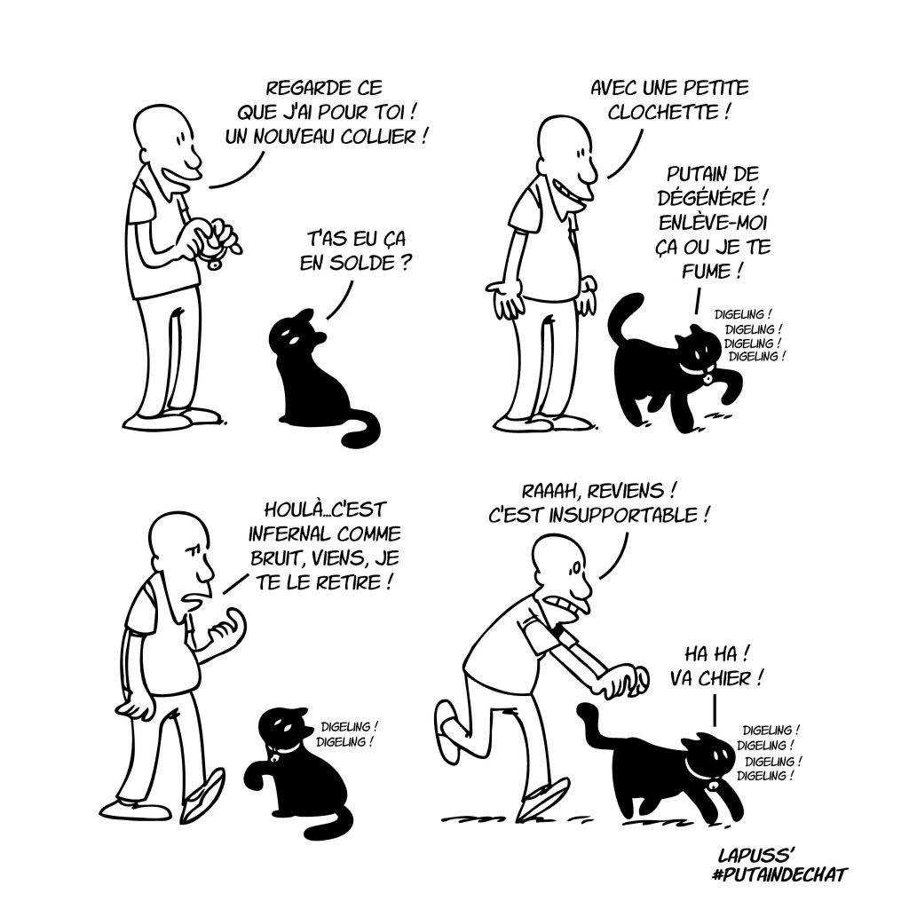

## Putain de chat, Lapuss'

**Vous aimez les chats? Ce livre est fait pour vous!**
Paru en 2019 aux éditions Kennes, cette BD écrite et illustrée par Lapuss' est à se tordre de rire.  
Attention à ne pas se fier aux apparences, cette BD n'est en aucun cas pour les enfants !  
Dans un style mélant dessins simples et écriture à l'humour grincant, Lapuss' nous raconte ce que nous cachent nos félins préférés.

Les chats sont bien connu comme étant certes de véritables boules d'amour mais également de grand vicieux,  
c'est ce deuxième aspect que nous montre l'auteur, rendant nos adorables boules de poils vulgaires et hautaines tout en  
réussissant à leur laisser leur mignonnerie.  
Cette serie de courtes BD au mini prix de 9€ se compose aujourd'hui de 11 livres soit un total de plus ou moins 600 pages de   pur plaisir.  
Je vous laisse découvrir en image un cours échantillion de ce qui vous attend dans tomme 1, de quoi vous donner envie de foncer l'acheter !  
*(Psst: un surprise vous attend en dessous de la photo)*  

**Vous avez déjà dévorer les 11 livres et vous ne pouvez plus vous en passer ? Bonne nouvelle, *Putain de chat* se renouvelle 
 dans une autre série de livre !**  
Pour votre plus grand plaisir Lapuss' s'ssocie à Tartuff afin de nous livrer une bd toujours aussi pertinente mais dorénavant  
sous forme de conte et illustrée de jolies aquarelles colorée !  
Venez découvrir ce merveilleux conte aux doux prix de 12€ qui saura vous charmer !  

**LIENS EXTERNES**

[Les sorcières de la République](livre2.md)

[Harry Potter par les éditions MinaLima](livre3.md)

[PAGE D'ACCUEIL](index.md)
