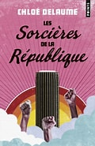

# Les sorcières de la République 

Changement de registre mais toujours aussi bien, je vous invite à découvrir l'un de mes livres favoris !

Découvrez d'abord le résumé :

"En 2020, la France choisit l’amnésie collective.  
Les trois années écoulées sont effacées des mémoires : la prise de pouvoir  
du Parti du Cercle, émanation d’une secte féministe, la contre-attaque des femmes invisibles  
après des millénaires de domination masculine.  
Quarante-deux plus tard s’ouvre le procès de la fondatrice du Parti.  
Les Français vont enfin connaître la vérité sur le Grand Blanc…"  

Ce roman distopique est à la fois poignant et tordant et son histoire vous emmenera dans un monde en proie à un procès hors du commun.  
Outre le procès en lui même vous pourrez découvrir des journalistes tel quil n'en existe pas ailleurs mais aussi d'hilarants échange de mail entre une déesse et Jésus.  
Bref pour 7€ Chloé Delaume vous prommait une séance de lecture que vous n'oublierez jamais.  

**LIENS EXTERNES**

[Putain de chat](livre1.md)

[Harry Potter par les éditions MinaLima](livre3.md)

[PAGE D'ACCUEIL](index.md)
