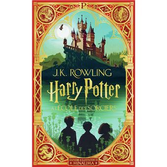
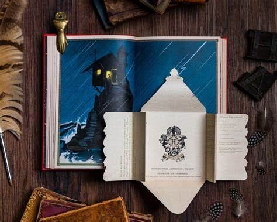
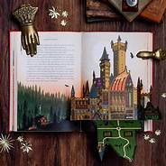
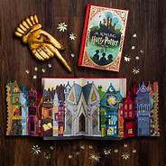

## Harry Potter

# **Vous êtes fan d'Harry Potter ? Vous ne pouvez pas passer à côté de ce livre !** 

Harry Potter est clairement *la* série de livres (et de films), vous pensez sûrement avoir fait le tour de la licence : **ET BIEN NON !**  
Les éditions Minalima ont réinvanter les livres pour le grand plaisir de petits et grands !  

"Découvrez ou redécouvrez le texte intégral de J.K. Rowling avec de sublimes illustrations en couleurs et huit surprises animées :  ouvrez la lettre de Poudlard, parcourez le Chemin de Traverse, faites apparaître un festin  
dans la Grande Salle...  
Vivez comme jamais auparavant l'aventure du plus célèbre des sorciers ! "  

Les éditions MinaLima sont fondés par Miraphora Mina et Eduardo Lima qui se spécialisent dans l'édition de livres *Pop-Up*, ils ullustrent les différents livres Harry Potter mais aussi d'autres contes comme *Peter Pan* ou  
*La Belle et la Bête*.  
Les livres "pop-up" ou "animés" sont populaires au près des enfants, le volume créé par l'ouverture de la page plonge directement le lecteur dans le monde de l'histoire, grâce aux éditions MinaLima cette expérience hors du commun se démocratise chez les plus grands !  

Sans trop vous spoiler, voici quelques images du tome 1 d'Harry Potter par MinaLima :

 

**LIENS EXTERNES**

[Putain de chat](livre1.md)

[Les sorcières de la République](livre2.md)

[PAGE D'ACCUEIL](index.md)
